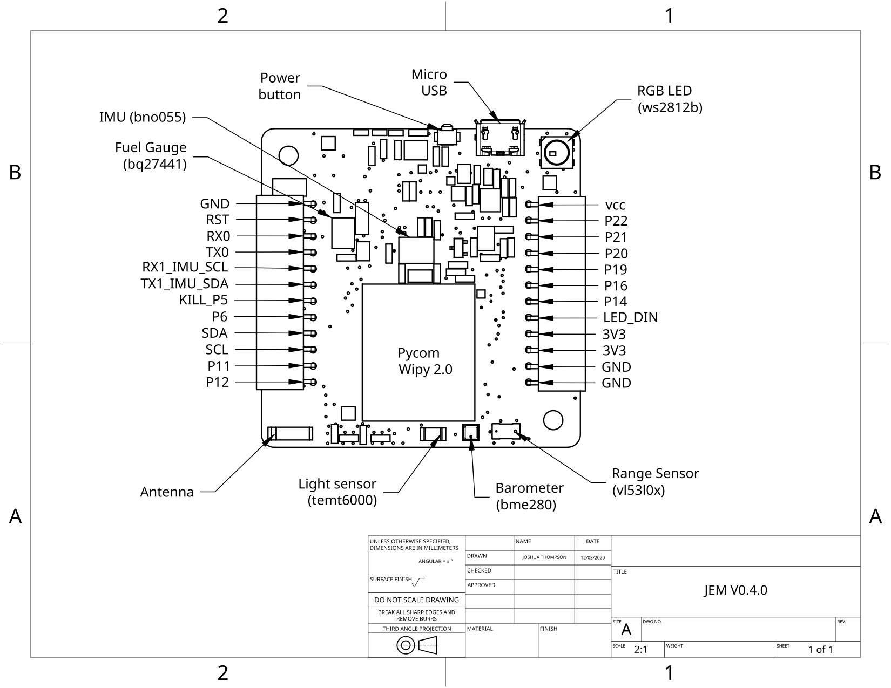

# JEM micropython api
Micropython code for JEM

## Install Instructions 
- Clone repo
```bash
>> https://github.com/kitlab-io/micropython.git
```
- Connect JEM Board to battery OR Micro USB Cable OR both
- Press JEM power button for 0.5 - 2 seconds and make sure BLUE led is ON (RGB LED will also toggle on/off every 4 seconds if new board)
- Install [Atom IDE](https://atom.io/)
- Install [Pymakr Atom Plugin](https://atom.io/packages/pymakr) to interface with JEM Pycom MCU
   + Required for first time JEM micropython install
- Open Jem Micropython directory **/micropython/api/jem/**  with Atom
   + IMPORTANT: make sure Atom opens **/micropython/api/jem/** and not **/micropython/api/**
      + there is a bug that prevents some of our libraries from importing correctly (which we will fix!)
- Your Atom IDE Project Directory should look like:
   + jem
      + app
      + drivers
      + helpers
      + testing
      + __init__.py
      + main.py
      + jem.py
      + ...etc
- Enable Pymakr terminal by selecting 'Packages -> Pymakr -> Toggle Pycom Console' in Atom toolbar
- If using USB
   + Click 'Connect' in Pymakr terminal and select suggested serial port
- If no USB, make sure JEM is on and go to your WiFi settings and connect to the JEM board (wlanxxxx)
   + Then Click 'Connect' in Pymakr terminal and select the WiFi ip address provided
- Make sure pycom firmware version is one of the version we support - see [Supported Pycom Firmware](https://github.com/kitlab-io/micropython/blob/main/README.md#pycom-firmware-upgrade-instructions)
   + Click on the 'Get Device Info' icon in terminal left hand corner
- Click on 'Upload' icon to flash latest JEM micropython to board

### JEM API Quickstart
#### Pycom specific micropython api
See [Pycom Micropython API](https://docs.pycom.io/firmwareapi/pycom/machine/) - for general micropython control of GPIO, I2C, SPI, UART and other features of the JEM Pycom MCU
```python
from machine import Pin

# initialize `21` in gpio mode and make it an output
p_out = Pin('21', mode=Pin.OUT)
p_out.value(1)
p_out.value(0)
p_out.toggle()
p_out(True)
```
- See section [JEM Board Pinout](https://github.com/kitlab-io/micropython/blob/main/README.md#jem-board-pinout)

#### JEM sensors api
##### IMU
```python
from jemimu import JemIMU
imu = JemIMU()
pos = imu.orientation
```

### BLE REPL Test
- Turn on JEM with power button (Blue LED should be flashing)
- Visit the Online [Micropython Bluetooth REPL](https://glennrub.github.io/webbluetooth/micropython/repl/)
- Click the 'CONNECT' button and then click on the 'JEM' device
- Now click on the terminal and press enter a couple times and you should see JEM respond with '>>>'
- You can enable or disable the Blue LED as an example
```python
>>>from pycom import heartbeat
>>>hearbeat(False) #verify this disables LED
>>>heartbeat(True) #verify this enabled the flashing LED again
```
- That's it!
- NOTE: this BLE app is limited and does not support full Micropython REPL features so should only be used to verify BLE works
- For JEM BLE APP IDE see: https://github.com/kitlab-io/app

## Pycom Firmware Upgrade Instructions
- Only upgrade if firmware on Pycom is not version we support 

### JEM V5.1.0
- Working with [Pycom Firmware Release 1.20.2.r4](https://github.com/pycom/pycom-micropython-sigfox/releases/tag/v1.20.2.r4)
- 
### Legacy Supported Pycom Firmware for JEM 0.4.0
- Older JEM V0.4.0 only supports Pycom firmware:
   + WiPy-1.18.2.r7.tar.gz
   + WiPy-1.18.2.r6.tar.gz
   + WiPy-1.18.2.r5.tar.gz
- Do not use latest Pycom firmware as there are known Bluetooth issues

### Using micro usb cable
- To upgrade the JEM Pycom WiPy MCU with the latest firmware follow instructions here
   + https://docs.pycom.io/gettingstarted/installation/firmwaretool.html
   + Make sure you have a micro usb cable to upgrade with
   + For JEM, connect jumper wires between LED_IN pin and GND and then reset board to force JEM into bootloader mode
      + If you don't do this before running the Pycom firmware upgrade application JEM won't upgrade
   + Make sure to use the legacy firmware mentioned above and not the firmware Pycom automatically assignes 
   
## JEM Board Pinout
For latest prototype board manufactured: [V0.4.0](https://github.com/kitlab-io/electronics/releases/tag/0.4.0)

