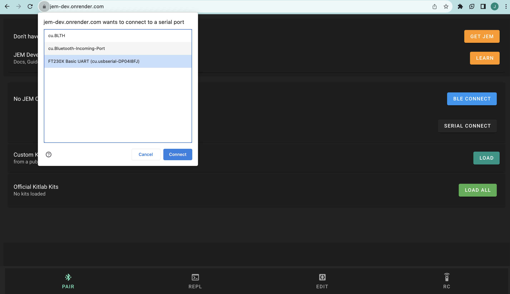
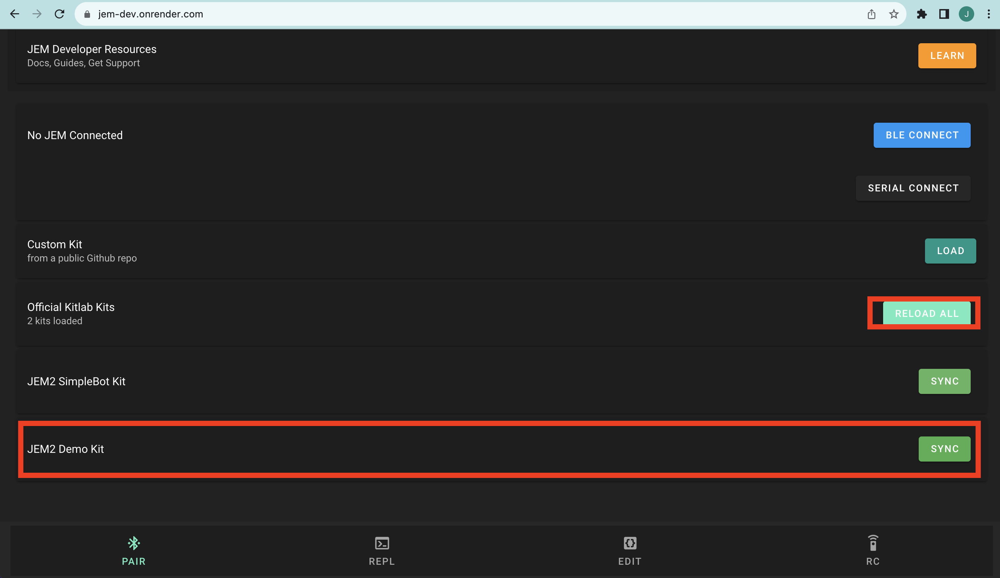
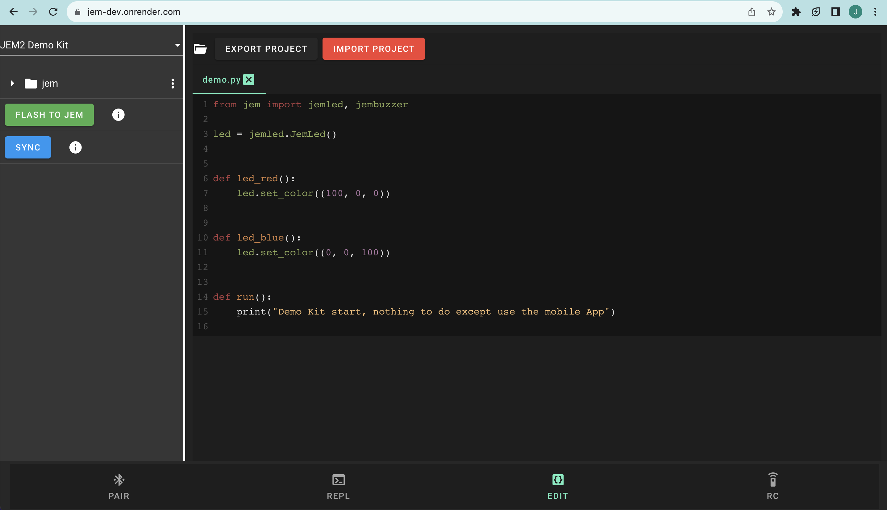

# JEM2 Micropython Overview
- Micropython code for JEM2 core
- This repo contains JEM2 specific drivers and libraries to interact with JEM2 ESP32 MCU as well as the sensors on board.
- Code is written in micropython, as easy to use interpreted language

## JEM2 Specs
- Core Microcontroller: ESP32 WROVER E
- Distance Sensor: vl53l0x
- 9 DoF IMU (accel, magnetometer, gyro): bno055
- Light Sensor: temt6000
- Buzzer: smt0540s2r
- Battery measurement sensor: bq27441
- Pressure / Temperature/ Humidity Sensor: bme280
- RGB LED: ws2812
- 600 mAh LiPo battery
- User button: For interacting with JEM
- WiFi and Bluetooth / BLE

## Quickstart
### Update your JEM2 with latest code over serial
- In Google Chrome Browser (must be chrome) go to: https://jem.kitlab.io/
- Connect your JEM2 to your computer via micro usb
- Turn on the JEM2 with the side power switch
- Click on **Serial Connect** button and select the JEM port
   + Mac / Linux: **usbserial-DP04I8FJ (Example)**
   + Windows: **COM3 (Example)**

- Wait about 5 seconds
- Below, click the **Load All** button next to the **Official KitLab Kits** section
- Select the **JEM2 Demo Kit** Sync button (may take 10 seconds to sync)


- After selecting, navigate to the **Edit** tab (near lower right hand corner)
- You should now see the **JEM2 Demo Kit** project in the File Explorer to your right
   + If it's says something else like **MicropythonBoard** just click on that and you should see the Demo Kit option
- Now click the **FLASH TO JEM** button and wait for prompt to reconnect to JEM2 after upload
   + This can take anywhere from 15 seconds to a couple minutes depending on how big the update is



### Interact with JEM via the Web IDE
- Visit: https://jem.kitlab.io/
   + Uses Bluetooth Low Energy (BLE) or Micro USB Connection to flash code to JEM from Web Browser
   + Must use Google Chrome and have a computer with Bluetooth enabled (most do)
- Step 1: Open https://kitlab.io/jem/ide
- Step 2: Make sure your JEM is turned on (Blue LED should be on)
- Step 3: Navigate to th 'Pair' tab on the Web IDE and click 'BLE CONNECT' or 'SERIAL CONNECT' and select JEM available
   + If selecting 'SERIAL CONNECT' make sure JEM is connected to your computer via micro usb cable
- Step 4: Navigate to the 'REPL' tab and press enter a couple times to make sure you get a prompt '>>'
- Step 5: Send a command to JEM
   + Type: print("hello world") 
   + Make sure JEM echos this back in the terminal
- Step 6: View JEM Board Files (make sure you are connected first)
   + Navigate to 'Editor' tab and verify you see the 'jem' folder
   + Click on it to expand and see files and sub-directories
   + These are files loaded directly from your board
   + Edit main.py by adding something like print("hello world")
   + Then click on the 'Flash' button on the bottom 
   + Wait for flash to finish and then reconnect when prompted

### Interact with JEM via iOS App
- Go to iOS app store and search for 'KitLab.io'
- Download App and open
- Navigate to 'Pair' tab and click 'Connect'
- Connect to JEM
- Navigate to 'REPL' tab
   + Type: print("hello world")
   + Make sure JEM echos this back in the terminal
- You can also edit files on JEM (like the WEB IDE) by navigating to the 'Editor' tab
- Android app coming soon!

## General JEM ESP32 Micropython Tutorial
- JEM uses the ESP32 Wrover IE with Micropython baked in
- There is great documentation [here](https://docs.micropython.org/en/latest/esp32/tutorial/index.html)
   + Shows you how to control JEM GPIO, PWM, I2C, Flash ..etc
- We highly recommend this tutorial for beginners or advanced users

### Simple LED test
- You can run this on the REPL tab here (https://jem.kitlab.io/)
   + Must connect to JEM first
```python
from jemled import JemLed

led = JemLed()
red = (0xFF, 0x00, 0x00)
led.set_color(red) # set color to red
led.off() # disable LED
```

- For more examples see [Pycom Micropython API](https://docs.pycom.io/firmwareapi/pycom/machine/)

### JEM Sensors
```python
from jemimu import JemIMU
imu = JemIMU()
imu.orientation

from jembattery import JemBattery
batt = JemBattery()
batt.soc() # battery life remaining 0 - 100%

from jemrange import JemRange
range = JemRange()
range.distance

from jemlight import JemLight
light = JemLight()
light.intensity()

from jembarometer import JemBarometer
bar = JemBarometer()
bar.read()

from drivers import button
btn = button.Button()
btn.read() # should return 0 or 1 depending if pressed

```

## Work with JEM ESP32 Bare Metial Firmware
- If you want to get real fancy you can edit the ESP32 Firmware
- See [here](https://docs.espressif.com/projects/esp-idf/en/latest/esp32/index.html)

## Connect over WiFi
- Coming soon!

## JEM Board


