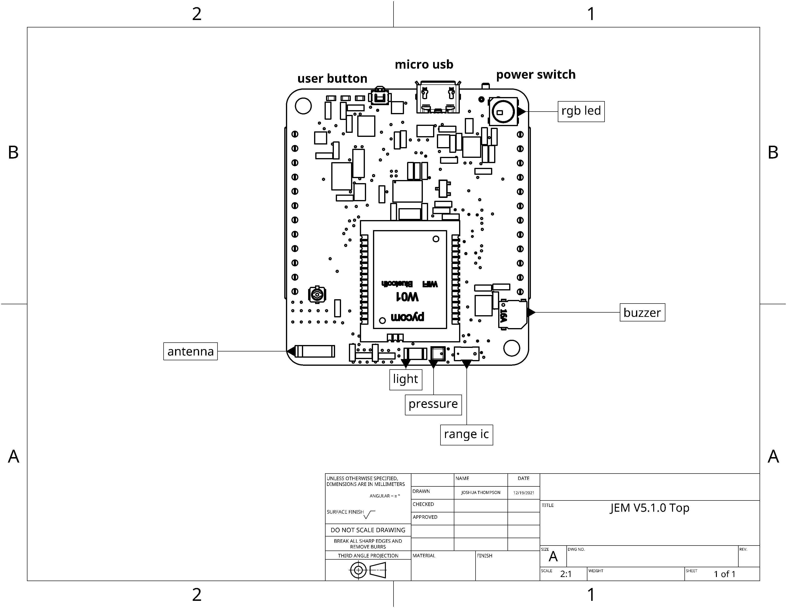

# JEM Micropython
Micropython code for JEM core

## Quickstart
### Install Atom IDE + Pymakr plugin
- [Atom IDE Download](https://atom.io/)
- [Atom Pymakr Plugin](https://atom.io/packages/pymakr)
   + Used by Atom to talk to JEM Micropython

### Flash latest Kitlab JEM Micropython to board
- Download / unzip latest Kitlab JEM micropython [release](https://github.com/kitlab-io/micropython/releases)
- Open Atom IDE and open directory **./micropython/api/jem**
- Turn on JEM board
- Open Pymakr terminal which will appear at bottom of Atom IDE
- Click 'Connect' to talk to JEM
- Click 'Upload' to flash latest code to JEM

### Run Demo application
- JEM Micropython code comes installed with a simple demo app
   + After power up it takes about 10 seconds for JEM to initialize
   + Then you can press the JEM user button and the RGB LED should turn green
- If you want to play around with the Demo, connect micro usb to JEM and open Pymakr terminal
- Interact with JEM Demo App using following micropython commands from REPL
```bash
# initially a button press thread is running that turns led green if pressed
# you can stop this by doing
>> kit._run = False #
# you can also stop the main demo thread that is collecting imu data to send to app by doing this
>> kit._main_thread = False
# now you can mess around
>> kit.jem.led.set_color(0x880000) # jem red rgb led
>> kit.jem.led.set_color(0x000088) # jem blue rgb led
>> kit.jem.imu.orientation # show roll, pitch, yaw degrees
>> kit.jem.buzzer.start(freq_hz = 100) # make buzzer sound
>> kit.jem.buzzer.stop()
>> kit.neopixel.sparkle(count=10) # randomly turns on ten leds, default color is white but you can change
>> kit.neopixel.sparkle(count=10, c=(127,0,0)) # sparkle red
>> kit.neopixel.sparkle(count=10, c=(0,0,127)) # sparkle blue
>> kit.neopixel.rainbow() # do some fancy lantern led show (take about 15 seconds)
>> kit.jem.btn.read() # read button value
```

### Neopixel + IMU
```bash
>> kit.start_sparkle_motion_thread(count=25, rainbow=True)
>> # now move the jem around a bit (around the roll axis is best)
>> demo.stop_sparkle_motion_thread()
```

### Run Demos from Led Matrix Library
- From: https://github.com/noahwilliamsson/lamatrix
- This is initialized by default in main.py
```bash
d.start_fire_scene()
# note, if you want to use the weather scene, you will need to add your home router ssid / password to config.js in /api/jem/kits/demo/config.js
# also, if you use the weather scene, your wifi repl won't work anymore (will fix later)
# stop the scene from running over and over
d.stop_render()
# add a bunch of scenes that will loop over and over (you can change scene timeout in config.js
d.start_fire_scene()
d.start_demo_scene()
d.start_animation_scene()
```


## Advanced
Users can control JEM gpio, pwm, adc, dac, uart and read from sensors

### Simple GPIO test
```python
from machine import Pin

# initialize `21` in gpio mode and make it an output
p_out = Pin('21', mode=Pin.OUT)
p_out.value(1)
p_out.value(0)
p_out.toggle()
p_out(True)
```

- For more examples see [Pycom Micropython API](https://docs.pycom.io/firmwareapi/pycom/machine/)

### JEM Sensors
```python
from jemimu import JemIMU
imu = JemIMU()
imu.orientation

from jembattery import JemBattery
batt = JemBattery()
batt.state_of_charge() # 0 - 100%

from jemrange import JemRange
range = JemRange()
range.distance

from jemlight import JemLight
light = JemLight()
light.intensity()

from jembarometer import JemBarometer
bar = JemBarometer()
bar.read()

from drivers import button
btn = button.Button()
btn.read() # should return 0 or 1 depending if pressed

# add buzzer instructions

# add rgb led instructions
```

## Connect over WiFi
- Open Atom IDE and connect to JEM over Pymakr terminal
- In REPL type
```bash
>> from jemwifi import *
>> wifi = setup_wifi(name="JemWifi") # can use any name you want
```
- Open your Wifi network and look for 'JemWifi' then connect
- Now go back to Atom IDE and click 'Connect'
   + select '192.168.4.1'
   + If you don't see an IP Address option restart Atom
- Now you can talk to JEM over Wifi and don't need USB cable
- To keep this setting after reset, put the following code in main.py
```python
from jemwifi import *
wifi = setup_wifi(name="JemWifi")
```
- Then 'Upload' code to board

## JEM Board


## Update JEM Pycom WIPY 3.0 firmware
- [pycom firmware update](https://docs.pycom.io/updatefirmware/device/)
  + Make sure to use firmware version specified in the JEM Micropython [Releases](https://github.com/kitlab-io/micropython/releases)
