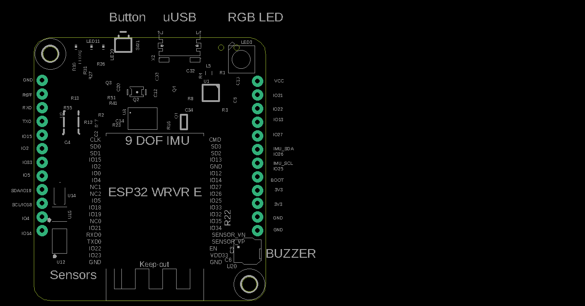

# JEM Micropython Overview
- Micropython code for JEM core
- This repo contains JEM specific drivers and libraries to interact with JEM ESP32 MCU as well as the sensors on board.
- Code is written in micropython, as easy to use interpreted language

## Quickstart
### Use Arduino Micropython IDE
- Download release https://github.com/arduino/lab-micropython-editor/releases
   + For mac, linux or windows just download the appropriate package and unzip
- Then open Micropython IDE and click 'Connect'
   + assuming your JEM is plugged into computer and turned ON
- You should see list of files / directories on your JEM
- REPL terminal also available
- You can edit a file and click the 'Save' button to flash the code to JEM

### Interact with JEM via the Web IDE
- [JEM Web IDE](https://kitlab.io/jem/ide)
   + Uses Bluetooth Low Energy (BLE) to flash code to JEM from Web Browser
   + Must use Google Chrome and have a computer with Bluetooth enabled (most do)
- Step 1: Open [JEM Web IDE](https://kitlab.io/jem/ide)
- Step 2: Make sure your JEM is turned on (Blue LED should be on)
- Step 3: Navigate to th 'Pair' tab on the Web IDE and click 'Connect' and select JEM available
- Step 4: Navigate to the 'REPL' tab and press enter a couple times to make sure you get a prompt '>>'
- Step 5: Send a command to JEM
   + Type: print("hello world") 
   + Make sure JEM echos this back in the terminal
- Step 6: View JEM Board Files (make sure you are connected first)
   + Navigate to 'Editor' tab and verify you see the 'jem' folder
   + Click on it to expand and see files and sub-directories
   + These are files loaded directly from your board
   + Edit main.py by adding something like print("hello world")
   + Then click on the 'Flash' button on the bottom 
   + Wait for flash to finish and then reconnect when prompted

### Interact with JEM via iOS App
- Go to iOS app store and search for 'KitLab.io'
- Download App and open
- Navigate to 'Pair' tab and click 'Connect'
- Connect to JEM
- Navigate to 'REPL' tab
   + Type: print("hello world")
   + Make sure JEM echos this back in the terminal
- You can also edit files on JEM (like the WEB IDE) by navigating to the 'Editor' tab
- Android app coming soon!

### Flash latest Kitlab JEM Micropython to board
- Download / unzip latest [release](https://github.com/kitlab-io/micropython/releases)
- Open Thonny IDE and open directory **/micropython/jem**
- Turn on JEM board and Connect to computer
- Restart connection on Thonny (red Stop button)
- Now select all files in your computer **micropython/jem** directory and then right click and hit 'Upload to /'
- This will update your JEM board with latest files

## General JEM ESP32 Micropython Tutorial
- JEM uses the ESP32 Wrover IE with Micropython baked in
- There is great documentation [here](https://docs.micropython.org/en/latest/esp32/tutorial/index.html)
   + Shows you how to control JEM GPIO, PWM, I2C, Flash ..etc
- We recommend this tutorial highly!


### Simple GPIO test
```python
from machine import Pin

# initialize `21` in gpio mode and make it an output
p_out = Pin('21', mode=Pin.OUT)
p_out.value(1)
p_out.value(0)
p_out.toggle()
p_out(True)
```

- For more examples see [Pycom Micropython API](https://docs.pycom.io/firmwareapi/pycom/machine/)

### JEM Sensors
```python
from jemimu import JemIMU
imu = JemIMU()
imu.orientation

from jembattery import JemBattery
batt = JemBattery()
batt.state_of_charge() # 0 - 100%

from jemrange import JemRange
range = JemRange()
range.distance

from jemlight import JemLight
light = JemLight()
light.intensity()

from jembarometer import JemBarometer
bar = JemBarometer()
bar.read()

from drivers import button
btn = button.Button()
btn.read() # should return 0 or 1 depending if pressed

# add buzzer instructions

# add rgb led instructions
```

## Work with JEM ESP32 Bare Metial Firmware
- If you want to get real fancy you can edit the ESP32 Firmware
- See [here](https://docs.espressif.com/projects/esp-idf/en/latest/esp32/index.html)

## Connect over WiFi
- Coming soon!

## JEM Board


